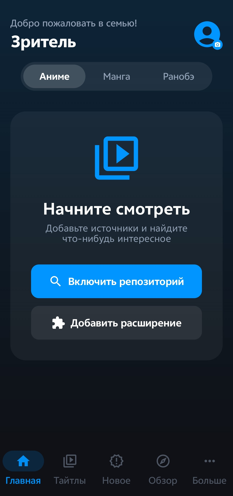
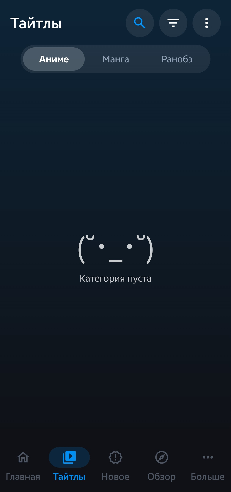
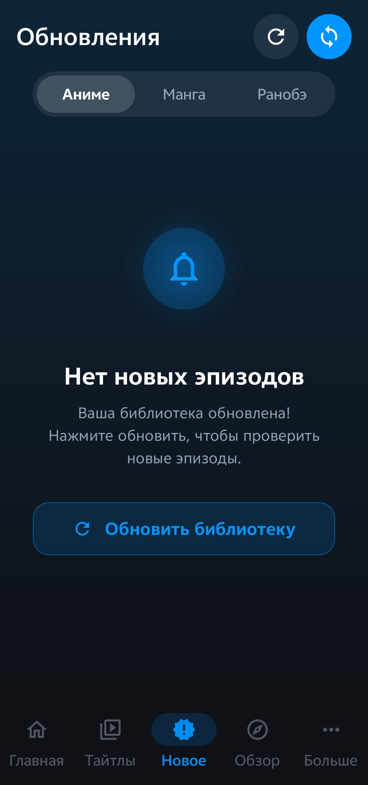
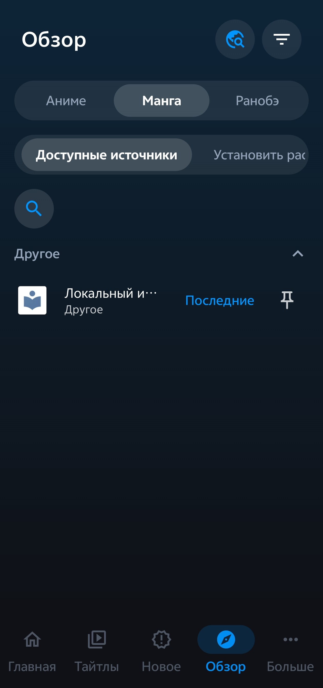
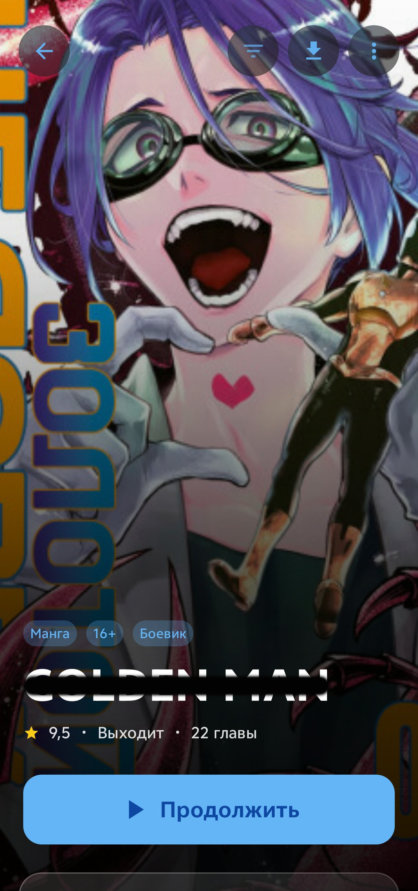
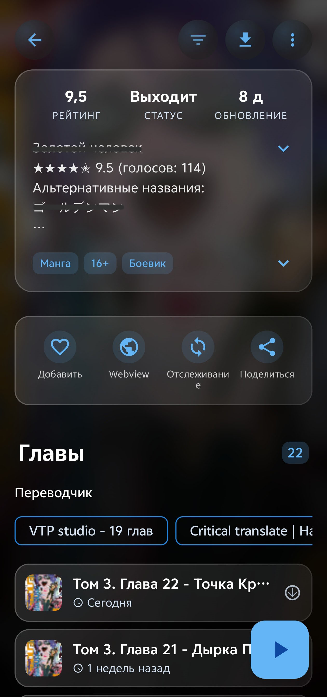
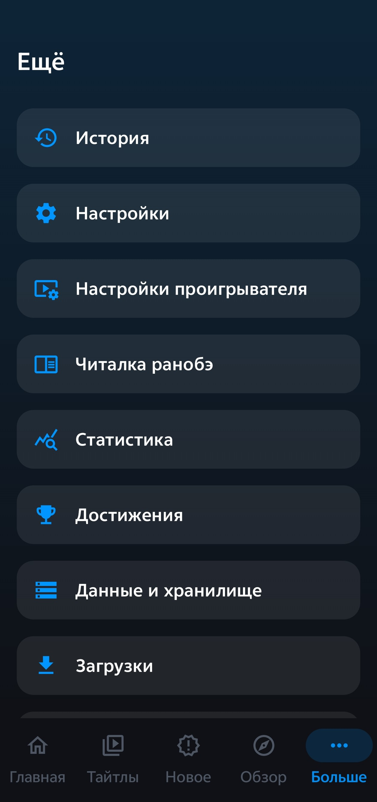

<div align="center">
  
  <h1>Tadami</h1>
  <p><strong>A polished Aniyomi fork for anime, manga, and novels (ranobe).</strong></p>
  <p>
    <a href="https://github.com/andarcanum/Tadami-Aniyomi-fork/releases"></a>
    <a href="LICENSE"></a>
    <a href="https://developer.android.com/about/versions/oreo"></a>
  </p>
</div>

## About

Tadami is a community fork of Aniyomi with a stronger focus on UI quality and reading experience, including active novel/ranobe support.

Current source version:
- `versionName`: `0.25`
- `versionCode`: `137`

## What Is Different In This Fork

- Aurora-inspired UI polish and cleaner navigation.
- Full anime, manga, and novel support in one app.
- Novel-oriented development (including compatibility tooling for LNReader plugin ecosystems).

## Features

| Area | Details |
| --- | --- |
| Media types | Anime, manga, and novels in one app |
| Sources and extensions | Separate browsing for anime, manga, and novel sources/extensions |
| Library and updates | Unified library management, updates, history, and download queues |
| Backup and restore | Backup/restore support across media types |
| Customization | Theme and behavior settings for player/reader experience |

## Screenshots

| Home | Library | Update | Browse |
| --- | --- | --- | --- |
|  |  |  |  |

| Title card | Title card 2 | More |
| --- | --- | --- |
|  |  |  |

## Download

Requires Android 8.0+ (API 26+).

- Stable builds and APKs: [Releases](https://github.com/andarcanum/Tadami-Aniyomi-fork/releases)

## Build From Source

Prerequisites:
- JDK 17
- Android SDK (compile SDK 35)
- Android Studio (recommended)

Build commands:

```bash
./gradlew assembleRelease
```

On Windows:

```powershell
.\gradlew.bat assembleRelease
```

APK output:
- `app/build/outputs/apk/release/`

## Contributing

Pull requests are welcome. See [CONTRIBUTING.md](CONTRIBUTING.md) for contribution guidelines.

## Disclaimer

This project does not host or distribute copyrighted content. Content availability depends on third-party sources and extensions.

## Credits

- [Mihon](https://github.com/mihonapp/mihon)
- [Aniyomi](https://github.com/aniyomiorg/aniyomi)

## License

Licensed under the Apache License 2.0. See [LICENSE](LICENSE).
